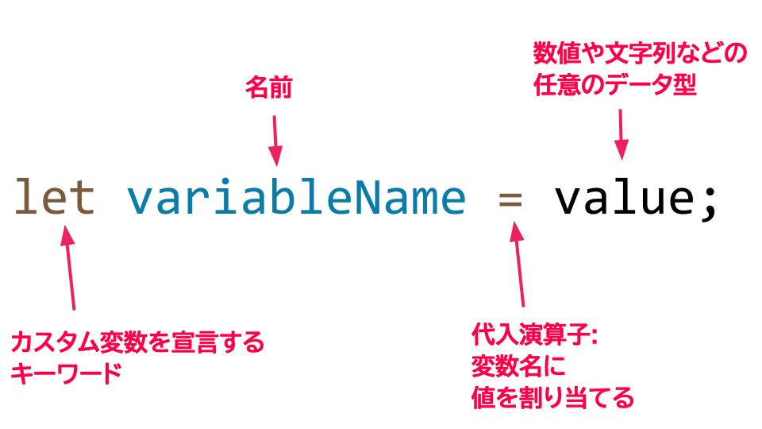

import Video from "../../../components/Video/index.astro"
import Callout from "../../../components/Callout/index.astro";
import EditableSketch from "../../../components/EditableSketch/index.astro";

このチュートリアルに従って、p5.jsでの変数の基本と動きの作成を学びながら、[アニメーションのある風景](https://editor.p5js.org/Msqcoding/sketches/WQWNKZppu)を作成しましょう。

<Video src="/videos/tutorials/landscape.mp4" alt="背景に三日月と山脈があり、前景に草と成長する木々がある、アニメーションのある風景。星がランダムに現れ、雲がキャンバス上を移動します。" />

このチュートリアルでは以下のことを学びます：

- p5.jsのスケッチで変数を宣言、初期化、更新する
- p5.jsの図形関数で変数、演算子、random()を使用してキャンバス上に動きを作成する
- p5.jsのプロジェクトに線形およびランダムな動きを追加する


## 前提条件：

- [環境のセットアップ](/tutorials/setting-up-your-environment)
- [はじめに](/tutorials/get-started)
- (オプション) [デバッグのフィールドガイド](/tutorials/field-guide-to-debugging)

始める前に、以下のことができるようになっているはずです：

- [p5.js Web Editor](https://editor.p5js.org/)にログインし、新しいプロジェクトを保存する
- キャンバスのサイズと背景色を変更する
  - [`background()`](/reference/p5/background), [`createCanvas()`](/reference/p5/createCanvas), [`setup()`](/reference/p5/setup), [`draw()`](/reference/p5/draw)
- 図形とテキストを追加してカスタマイズする
  - [`circle()`](/reference/p5/circle)や[`rect()`](/reference/p5/rect)などの2D基本図形
  - [`text()`](/reference/p5/text), [`fill()`](/reference/p5/fill), [`stroke()`](/reference/p5/stroke), [`textSize()`](/reference/p5/textSize)
- [`mouseX`](/reference/p5/mouseX)と[`mouseY`](/reference/p5/mouseY)を使用して簡単なインタラクティブ性を追加する
- [コードにコメントを追加する](https://developer.mozilla.org/en-US/docs/MDN/Writing_guidelines/Writing_style_guide/Code_style_guide/JavaScript#comments)
- [エラーメッセージ](/tutorials/field-guide-to-debugging)を読んで対処する


## ステップ1：開始点を選ぶ<a id="step-1"></a>

[p5.js Web Editor](https://editor.p5js.org/)にログインし、以下のオプションから1つ選んでください：

- 前回の[はじめてのチュートリアル](/tutorials/get-started)を完了している場合：
  - [インタラクティブな風景](https://editor.p5js.org/p5Master718/sketches/aDwxcxCbV)を複製し、新しい名前を付けます。
    - [インタラクティブな風景](https://editor.p5js.org/p5Master718/sketches/aDwxcxCbV)を開き、*File*をクリックし、*Duplicate*を選択します。
    - 名前を「Animated Landscape」などに変更します。
  - [ステップ3](#step-3)に進みます。
- 最初から始める場合：
  - キャンバス上に図形やテキストを配置するのに役立つコードが含まれている[このテンプレート](https://editor.p5js.org/Msqcoding/sketches/nHyx0xDG6)を使用します：
  - [テンプレート](https://editor.p5js.org/Msqcoding/sketches/nHyx0xDG6)を複製し、新しい名前を付けます。
    - この[テンプレートリンク](https://editor.p5js.org/Msqcoding/sketches/nHyx0xDG6)を開き、*File*をクリックし、*Duplicate*を選択します。
    - 名前を「Animated Landscape」などに変更します。
  - テンプレートを使用せずに新しいp5.jsプロジェクトを開き、「Animated Landscape」という名前を付けて保存することもできます。
    - ヘルパーコードを使用したい場合は、以下の行を[`draw()`](/reference/p5/draw)関数にコピーしてください：

      ```js
      //マウスのx座標とy座標をキャンバス上に表示します
      fill(255) //白いテキスト
      text(`${mouseX}, ${mouseY}`, 20, 20);
      ```

<Callout title="ヒント">
[p5.js Web Editor](https://editor.p5js.org/)で*Play*をクリックし、「Auto-refresh」の横にあるチェックボックスをオンにすると、プロジェクトにコードを追加するたびにキャンバスが継続的に更新されます。このボックスをチェックすると、スケッチに変更を加えるたびに*Play*ボタンを押す必要がなくなります。
</Callout>

[テンプレート](https://editor.p5js.org/Msqcoding/sketches/nHyx0xDG6)を複製した場合、コードは以下のようになるはずです：

<EditableSketch code={`
function setup() {
  createCanvas(400, 400);
}

function draw() {
  background(220);
  //ここにコードを配置します

  // マウスのx座標とy座標をキャンバス上に配置します
  fill(0)
  text(\`\${mouseX}, \${mouseY}\`, 20, 20);
}
`} />

``text(`${mouseX}, ${mouseY}`, 20, 20);``というコード行は、マウスポインタのx座標とy座標を座標ペアx, yとして表示します。最初の数字、変数[mouseX](/reference/p5/mouseX)の値は、マウスポインタがキャンバス上を移動する際のx座標を表します。2番目の数字、変数[mouseY](/reference/p5/mouseY)の値は、マウスポインタのy座標を表します。


<Callout title="ヒント">
このテキストを表示し続けるには、このコードが[`draw()`](/reference/p5/draw)の最後の行に表示されていることを確認してください。背景とブレンドする場合は、[`fill()`](/reference/p5/fill)の値を変更してテキストの色を変更する必要があるかもしれません。座標が不要になったら、[`fill()`](/reference/p5/fill)と[`text()`](/reference/p5/text)関数の前に`//`を入力します。これにより、それらの行をコメントとして隠すことで、プログラムにそれらの行をスキップするよう指示します！

**忘れずに：** プログラムの最後の行は`}`（閉じ中括弧）であるべきです。これは[`draw()`](/reference/p5/draw)関数のブロックを閉じます。
</Callout>

コメントについて詳しく学ぶには、この[リファレンス](https://developer.mozilla.org/en-US/docs/MDN/Writing_guidelines/Writing_style_guide/Code_style_guide/JavaScript#comments)を参照するか、[このビデオ](https://www.youtube.com/watch?v=xJcrPJuem5Q)をご覧ください。


### 変数

変数は、スケッチで使用できる値を格納します。**変数は、時間とともに変化する要素をスケッチに追加する際に非常に役立ちます。** 変数は計算、メッセージ、関数の引数など、さまざまな用途に使用できます！

[`mouseX`](/reference/p5/mouseX)と[`mouseY`](/reference/p5/mouseY)は、p5.jsライブラリに組み込まれている変数です。これらは、マウスポインタがキャンバス上をドラッグされる際のx座標とy座標を格納します。[はじめに](/tutorials/get-started)チュートリアルでは、[`mouseX`](/reference/p5/mouseX)と[`mouseY`](/reference/p5/mouseY)をてんとう虫や他の絵文字のx座標とy座標として使用した[インタラクティブな風景](https://editor.p5js.org/p5Master718/sketches/aDwxcxCbV)を作成しました。これにより、絵文字がキャンバス上でマウスポインタをドラッグすると追従し、アートワークをインタラクティブにすることができました！

上記のテンプレートでは、[`mouseX`](/reference/p5/mouseX)と[`mouseY`](/reference/p5/mouseY)を使用して、[`text()`](/reference/p5/text)関数を使ってマウスのx座標とy座標をキャンバス上に表示しています。変数は[`text()`](/reference/p5/text)関数と[文字列補間](https://www.geeksforgeeks.org/string-interpolation-in-javascript/)（例2）を使用してテキストと一緒にキャンバス上に表示できます。


### 文字列補間

[はじめに](/tutorials/get-started)では、文字列が常に引用符（`""`）で囲まれた[データ型](https://developer.mozilla.org/en-US/docs/Web/JavaScript/Data_structures)であることを学びました。変数と文字列を一緒に使用するために、[テンプレートリテラル](https://developer.mozilla.org/en-US/docs/Web/JavaScript/Reference/Template_literals)を使用できます！テンプレートリテラルは引用符（`""`）の代わりにバッククォート（``）で始まり終わります。[この例](https://editor.p5js.org/Msqcoding/sketches/pfSJLvxOB)のように、バッククォートの間に任意の文字を入力して文字列を生成できます。`${}`プレースホルダーを使用し、中括弧内に変数名を配置することで、[この例](https://editor.p5js.org/Msqcoding/sketches/8sM-h5Hd9)のように文字列に変数を含めることができます。

詳しくは[文字列補間](https://www.geeksforgeeks.org/string-interpolation-in-javascript/)（例2）、[テンプレートリテラル](https://developer.mozilla.org/en-US/docs/Web/JavaScript/Reference/Template_literals)、またはp5.jsの[string](/reference/p5/String)リファレンスページをご覧ください！

<Callout title="注意">
[数値](/reference/p5/number)を含む変数は、数値が必要な場所で引数として使用できます。[文字列](/reference/p5/String)を格納する変数を数値が必要な場所で使用すると、コンソールに`"...was expecting Number for the first parameter, received string instead."`のようなエラーメッセージが表示されます。一般的なエラーとその修正方法については、[デバッグのフィールドガイド](/tutorials/field-guide-to-debugging)のエラーメッセージセクションをご覧ください！
</Callout>

## ステップ2：背景の風景を作成する<a id="step-2"></a>

- 背景に色を付けます。
- 風景の形（太陽や月、山、建物、家、木など）を追加し、色を付けます。
- コードの各セクションを説明するコメントを追加します。

キャンバス上で色と形を使用する方法の詳細については、[はじめにのステップ4〜6](/tutorials/get-started)を参照してください。

コードは次のようになります：

<EditableSketch code={`
function setup() {
  createCanvas(400, 400);
}

function draw() {
  background('navy'); //紺色の背景

  //月
  fill(255);
  stroke(0);
  circle(350, 50, 100);

  //三日月のための重なる紺色の円
  stroke("navy");   
  fill("navy");
  circle(320,50,100);

  //大きな灰色の山
  stroke(0);
  fill(80);
  triangle(-40,300,75,100, 250,300);
  triangle(100,300,300,100, 500,300);

  //草
  fill('rgb(50,76,50)');
  rect(0,300, 400, 100);

  //マウスのx座標とy座標をキャンバス上に表示します
  fill(255) //白いテキスト
  text(\`mouseX: \${mouseX}, mouseY: \${mouseY}\`, 20, 20);  
}
`} />

上記のコードでは、[`circle()`](/reference/p5/circle)と[`triangle()`](/reference/p5/triangle)の形を使用して風景内のオブジェクトを作成し、[`fill()`](/reference/p5/fill)と[`stroke()`](/reference/p5/stroke)を使用して形と輪郭に色を付けています。

- [`background()`](/reference/p5/background)はキャンバスの背景色を変更するために使用されます。
- [`draw()`](/reference/p5/draw)は繰り返しコードを実行します。これにより、[`draw()`](/reference/p5/draw)の最後に表示される形が、近くに配置されている場合、最初に来る形と重なることができます。
  - 三日月は2つの[`circle()`](/reference/p5/circle)形を重ねることで作成されました。
    - [この例](https://editor.p5js.org/Msqcoding/sketches/eHkwP3yBC)では、重なる2つの円を使用して三日月を作成しています。
  - 山は2つの重なる[`triangle()`](/reference/p5/triangle)形を使用して作成されました（以下の図を参照）。
    - [この例](https://editor.p5js.org/p5Master718/sketches/CxuLJszOL)は、重なる三角形を使用してより詳細な山を作成する方法を示しています。
- [`triangle()`](/reference/p5/triangle)は、キャンバス上に表示するために3つの点の位置が必要です。各点にはx座標とy座標の値があります。最初の2つの数字は最初の点のx座標とy座標（x<sub>1, </sub>y<sub>1</sub>）、次の2つの数字は次の点の座標（x<sub>2, </sub>y<sub>2</sub>）、最後の2つは最後の点の座標（x<sub>3, </sub>y<sub>3</sub>）です。


あなたの風景は上記のコードサンプルとは大きく異なる可能性があります。以下の形をスケッチで自由に使用してください（リンクをクリックして詳細を学びましょう）：[`rect()`](/reference/p5/rect)  |  [`triangle()`](/reference/p5/triangle)  |  [`ellipse()`](/reference/p5/ellipse)  |  [`circle()`](/reference/p5/circle)  |  [`line()`](/reference/p5/line)  |  [`square()`](/reference/p5/square)  |  [`quad()`](/reference/p5/quad)  |  [`point()`](/reference/p5/point)  |  [`arc()`](/reference/p5/arc)

プロジェクトで形と色を使用する方法についてさらに学ぶには、以下のリソースをご覧ください：[`fill()`](/reference/p5/fill)  |  [`stroke()`](/reference/p5/stroke)  |  [`background()`](/reference/p5/background)  |  [`draw()`](/reference/p5/draw)

[デバッグのフィールドガイド](/tutorials/field-guide-to-debugging)とThe Coding Trainの[このビデオ](https://www.youtube.com/watch?v=LuGsp5KeJMM\&list=PLRqwX-V7Uu6Zy51Q-x9tMWIv9cueOFTFA\&index=6)で強調されている一般的なエラーを避けるようにしてください。

## ステップ3：カスタム変数を使用して形を描く<a id="step-3"></a>

- [`ellipse()`](/reference/p5/ellipse)メソッドを使用して、キャンバスの空に白い雲を配置します。
  - 以下のテキスト行を草のコードの直下に追加します：

    ```js
    //雲
    fill(255);
    ellipse(50, 50, 80, 40);
    ```

- `cloudOneX`という名前のカスタム変数を作成し、その中に数字50を格納します – この変数はプログラム全体を通して白い雲のx座標の値を格納します。
  - 以下のテキスト行を[`setup()`](/reference/p5/setup)の前に追加します：

    ```js
    //雲のx座標のためのカスタム変数
    let cloudOneX = 50;
    ```

- `ellipse(50, 50, 80, 40);`のx座標を`cloudOneX`変数に置き換えます。
  - このコード行は以下のようになるはずです：

    ```js
    ellipse(cloudOneX, 50, 80, 40);
    ```

コードは次のようになります：

<EditableSketch code={`
//雲のx座標のためのカスタム変数
let cloudOneX = 50;

function setup() {
  createCanvas(400, 400);
}

function draw() {
  background('navy'); //紺色の背景

  //月
  fill(255);
  stroke(0);
  circle(350, 50, 100);

  //三日月のための重なる紺色の円
  stroke("navy");   
  fill("navy");
  circle(320,50,100);

  //大きな灰色の山
  stroke(0);
  fill(80);
  triangle(-40,300,75,100, 250,300);
  triangle(100,300,300,100, 500,300);

  //草
  fill('rgb(50,76,50)');
  rect(0,300, 400, 100);
  
  //雲
  fill(255);
  ellipse(cloudOneX, 50, 80, 40);

  //マウスのx座標とy座標をキャンバス上に表示します
  fill(255) //白いテキスト
  text(\`mouseX: \${mouseX}, mouseY: \${mouseY}\`, 20, 20);
} 
`} />

[`ellipse()`](/reference/p5/ellipse)はキャンバス上に表示するために4つの数値が必要です。最初の2つの数字（x, y）は中心点のx座標とy座標です。最後の2つの数字は楕円のピクセル幅と高さを表します。


上記のコードでは、雲は[`ellipse()`](/reference/p5/ellipse)を使用して描かれており、`cloudOneX`（数値50を格納）をx座標として、50をy座標として、幅80ピクセル、高さ40ピクセルで描画されています。


### カスタム変数

カスタム変数は、後で変更可能な[数値](/reference/p5/number)や[文字列](/reference/p5/String)などの値を格納します。カスタム変数は変更可能な値を格納するため、キャンバス上の形のx座標やy座標、サイズを変更するのに使用できます。形のx座標やy座標が変更されると、それは動いているように見えます。このステップでは：

- [`ellipse()`](/reference/p5/ellipse)を使用して、x座標として数値50を使用して白い雲をキャンバス上に配置しました；
- [`setup();`](/reference/p5/setup)の前に`cloudOneX`という名前のカスタム変数を*宣言*しました
  - プログラムで使用するカスタム変数を作成する場合、名前を付け、キーワード[`let`](/reference/p5/let)を使用して*宣言*する必要があります。
  - 変数は任意の名前で*宣言*できますが、変数の用途を思い出すのに役立つ名前を使用するのが最適です！
- `cloudOneX`に数値50を割り当てて*初期化*しました。
  - *代入演算子*（`=`）を使用して変数に値を格納できます – これは特定の変数に値を割り当てます。
  - カスタム変数に初めて値が格納されるとき、それを変数の*初期化*と呼びます。



最後に、変数名`cloudOneX`を[`ellipse()`](/reference/p5/ellipse)のx座標の引数として使用できます。`cloudOneX`変数には数値50が格納されているため、数値が必要な任意の関数で`cloudOneX`を引数として使用できます。ここでは、白い雲のx座標として数値50を`cloudOneX`変数名に置き換えて使用しました：`ellipse(cloudOneX, 50, 80, 40);`。


### 変数のスコープ

*変数のスコープ*は、プログラム内でその変数を使用できる場所を説明します。カスタム変数を[`setup()`](/reference/p5/setup)と[`draw()`](/reference/p5/draw)の外部で宣言することがしばしば有用です。なぜなら、これにより変数が*グローバルスコープ*を持つことができるからです。*グローバルスコープ*を持つ変数は、プログラムのどこでも使用できます。グローバル変数は多くの場合、コードの最初の行で宣言されます。これはプログラマーが何が変更されているかを理解するのに役立ち、コードの保守を容易にし、コードの後半での混乱を避けるのに役立ちます。[`mouseX`](/reference/p5/mouseX)、[`mouseY`](/reference/p5/mouseY)、[`width`](/reference/p5/width)、[`height`](/reference/p5/height)などの組み込み変数は、p5.jsライブラリに組み込まれているため宣言する必要がなく、グローバルスコープを持っているためコードのどこでも使用できます！

他の関数（[`draw()`](/reference/p5/draw)や[`setup()`](/reference/p5/setup)など）内で宣言された変数は*ローカルスコープ*を持ちます – つまり、それらが宣言されたブロックまたは関数内でのみ使用できます。[`setup()`](/reference/p5/setup)で宣言された変数は[`draw()`](/reference/p5/draw)や他の関数で使用できず、[`draw()`](/reference/p5/draw)で定義された変数は[`setup()`](/reference/p5/setup)で使用できません。グローバルとローカル変数のスコープの[この例](https://editor.p5js.org/p5Master718/sketches/aa8bBwGHb)をご覧ください。

カスタム変数の宣言、初期化、使用についてさらに学ぶには、これらのp5.jsリファレンスページをご覧ください：[`let`](/reference/p5/let)、[numbers](/reference/p5/number)、[strings](/reference/p5/String)。

### アニメーションのための変数の使用

キャンバス上の形のx座標やy座標が変化すると、その形が動いているように見えます。キャンバス上に表示される任意のものの x座標やy座標の代わりに変数を使用できます。例：

- `cloudOneX`に格納されている値を、初期化されている値を置き換えることで変更し、キャンバス上の白い雲の変化を観察します。
  - `cloudOneX`の値が増加すると、白い雲は右に移動しているように見えます。
  - `cloudOneX`の値が減少すると、白い雲は左に移動しているように見えます。

次のステップでは、`cloudOneX`の値を変更して、雲がキャンバス上で水平に移動しているように見えるようにします。


## ステップ4：水平方向の動きを追加する<a id="step-4"></a>

- 白い雲の下の行に、以下のコードを追加します：

  ```js
  //x座標をフレームカウントに設定します
  //左端でリセットします
  cloudOneX = frameCount % width
  ```

コードは次のようになります：

<EditableSketch code={`
//雲のx座標のためのカスタム変数
let cloudOneX = 50;

function setup() {
  createCanvas(400, 400);
}

function draw() {
  background('navy'); //紺色の背景
  
  //月
  fill(255);
  stroke(0);
  circle(350, 50, 100);
  //三日月のための重なる紺色の円
  stroke("navy");   
  fill("navy");
  circle(320,50,100);

  //大きな灰色の山
  stroke(0);
  fill(80);
  triangle(-40,300,75,100, 250,300);
  triangle(100,300,300,100, 500,300);
  
  //草
  fill('rgb(50,76,50)');
  rect(0,300, 400, 100);
  
  //雲
  fill(255);
  ellipse(cloudOneX, 50, 80, 40);

  //x座標をフレームカウントに設定します
  //左端でリセットします
  cloudOneX = frameCount % width

  //マウスのx座標とy座標をキャンバス上に表示します
  fill(255) //白いテキスト
  text(\`mouseX: \${mouseX}, mouseY: \${mouseY}\`, 20, 20);  
}
`} />

上記のステップでは、`cloudOneX`を`frameCount % width`の値に設定しました。[`draw()`](/reference/p5/draw)が繰り返し実行されることを思い出してください：

- [`frameCount`](/reference/p5/frameCount)は、[`draw()`](/reference/p5/draw)が実行された回数を保存する組み込み変数です。この値は、プログラムが実行されている限り増加し続けます。
  - [`frameCount`](/reference/p5/frameCount)に格納される値を表示する[この例](https://editor.p5js.org/p5Master718/sketches/hT1KJ-RF4)をご覧ください。
- [`width`](/reference/p5/width)は、[`createCanvas()`](/reference/p5/createCanvas)で定義されたキャンバスの幅を格納する組み込み変数です。この例では、[`width`](/reference/p5/width)が400で[`height`](/reference/p5/height)が400であることがわかります。
- [`%`](https://developer.mozilla.org/en-US/docs/Web/JavaScript/Reference/Operators/Remainder)は剰余演算子（モジュロとも呼ばれます）です - 左側の数（[`frameCount`](/reference/p5/frameCount)）を右側の数（400）で割り、その余りを返します。以下の表は、プログラムの実行中に[`frameCount`](/reference/p5/frameCount)と`frameCount % width`がどのように変化するかを示しています（**[`width`](/reference/p5/width)が400の場合**）：

<table >

<tr>

<th>

`frameCount`

</th>

<th>

`frameCount % width`

</th>

</tr>

<tr>

<td>

0

</td>

<td>

0

</td>

</tr>

<tr>

<td>

100

</td>

<td>

100

</td>

</tr>

<tr>

<td>

300

</td>

<td>

300

</td>

</tr>

<tr>

<td>

400

</td>

<td>

0

</td>

</tr>

<tr>

<td>

500

</td>

<td>

100

</td>

</tr>

<tr>

<td>

700

</td>

<td>

300

</td>

</tr>

<tr>

<td>

800

</td>

<td>

0

</td>

</tr>

</table>

- `cloudOneX = frameCount % width`の場合：
  - [`frameCount`](/reference/p5/frameCount)が400未満の場合、`frameCount % width`は[`frameCount`](/reference/p5/frameCount)の値を返します。
    - 例：[`frameCount`](/reference/p5/frameCount)が40の場合、`frameCount % width`は40を返し、`cloudOneX`に格納します。これにより、白い雲がx座標40に移動します。
  - [`frameCount`](/reference/p5/frameCount)が増加するにつれて、新しい値が`cloudOneX`に格納され、白い雲は右に移動しているように見えます（より高いx座標）。
  - [`frameCount`](/reference/p5/frameCount)が[`width`](/reference/p5/width)と等しくなると、`frameCount % width`は0を返します。これにより、雲の位置がx座標0（キャンバスの左端）にリセットされます。
  - [`frameCount`](/reference/p5/frameCount)が[`width`](/reference/p5/width)より大きくなると、`frameCount % width`は再び[`frameCount`](/reference/p5/frameCount)の値を返し始めます。
    - 例：[`frameCount`](/reference/p5/frameCount)が440の場合、`frameCount % width`は40を返し、`cloudOneX`に格納します。
  - [`frameCount`](/reference/p5/frameCount)が[`width`](/reference/p5/width)の倍数に達するたびに、`frameCount % width`は0になり、雲がキャンバスの左端（x座標が0の位置）にリセットされたように見えます。

プログラムが実行されると：

- `cloudOneX`が宣言され、50の値で初期化されます。
- [`setup()`](/reference/p5/setup)が実行され、幅400ピクセルのキャンバスを作成します。
- [`draw()`](/reference/p5/draw)が最初に実行されるとき：
  - 背景と風景のすべての形がキャンバス上に描画されます；
  - 雲がx座標`cloudOneX`（数値50を格納）で描画されます；
  - `cloudOneX`に`frameCount % width`の余りが格納されます。
- [`draw()`](/reference/p5/draw)が2回目に実行されるとき：
  - 背景と風景が再び描画されると、すべての形が覆われます；
  - 新しい雲が`cloudOneX`の新しい値で上に描画され、x座標0から400まで移動し、その後リセットしたように見える錯覚を作り出します；
  - このパターンは[`draw()`](/reference/p5/draw)が停止するまで続きます。

キャンバス上を形が移動する際の[`frameCount`](/reference/p5/frameCount)と`frameCount % width`の値を表示する[この例](https://editor.p5js.org/p5Master718/sketches/wpAhQK9WN)をご覧ください。詳細については、[MDNの剰余リファレンス](https://developer.mozilla.org/en-US/docs/Web/JavaScript/Reference/Operators/Remainder)をご覧ください！

### アニメーションとdraw()

[`draw()`](/reference/p5/draw)関数は繰り返しコードを実行し、一連の静止画をアニメーション化するフリップブックのように動作します。

- [フリップブックアニメーション](https://www.youtube.com/watch?v=J2xrN5WQuxw)の例

[`draw()`](/reference/p5/draw)が背景と風景の形のコードを読み取るたびに、前回[`draw()`](/reference/p5/draw)が実行されたときにキャンバス上に描画されたものを覆います。これにより、[`draw()`](/reference/p5/draw)が実行されるたびにキャンバス上のものが変化すると、フリップブックの次のページをめくったかのように見えます。

- [この例](https://editor.p5js.org/p5Master718/sketches/H3dfPaKaN)は、円がキャンバス上を水平に移動する際のx座標の変化を示しています。
- [この例](https://editor.p5js.org/p5Master718/sketches/CHPMI1xBJ)は、円がキャンバス上を垂直に移動する際のy座標の変化を示しています。
- [この例](https://editor.p5js.org/p5Master718/full/vEDfXfXBJ)は、プログラムの実行中に円のサイズが変化する様子を示しています。
- これらの例は、[`draw()`](/reference/p5/draw)関数が実行されるたびに新しい位置に新しい形が描画される様子を示しています：[水平方向の動き](https://editor.p5js.org/p5Master718/sketches/hSv6uLFvv) | [垂直方向の動き](https://editor.p5js.org/p5Master718/sketches/Xk_MUZ9yT) | [ランダムな動き](https://editor.p5js.org/Msqcoding/sketches/yLtbuqPIG)
  - これらの例では、[`draw()`](/reference/p5/draw)が提供する「フリップブック」の錯覚を取り除くために[`background()`](/reference/p5/background)が削除されています。これにより、背景がそれを覆わないため、描画されるすべての新しい形を見ることができます。

詳細については、[`draw()`](/reference/p5/draw)のp5.jsリファレンスをご覧ください。

### `frameRate()`、`frameCount`、`console.log()`

[`draw()`](/reference/p5/draw)が実行される回数は[`frameCount`](/reference/p5/frameCount)変数に格納され、1秒間に[`draw()`](/reference/p5/draw)が実行される回数は*フレームレート*として知られています。デフォルトでは、フレームレートはコンピュータによって設定され、ほとんどのコンピュータでは約60です。これは、[`draw()`](/reference/p5/draw)に表示されるコードが1秒間に約60回実行されることを示しています。

[`frameRate()`](/reference/p5/frameRate)関数を使用して、[`draw()`](/reference/p5/draw)の*フレームレート*を設定および表示できます。[`console.log()`](/reference/console/log)を使用して、フレームレートと[`frameCount`](/reference/p5/frameCount)の値をコンソールに表示できます。

- [この例](https://editor.p5js.org/p5Master718/sketches/7j0u_pljk)は、ランダムな円のアニメーションを示し、コンソールにフレームレートを表示します。
- [この例](https://editor.p5js.org/p5Master718/sketches/CH2Nmbzwz)は、ランダムな円のアニメーションを示し、フレームレートを新しい値に設定し、それをコンソールに表示します。

詳細については、以下のp5.jsリファレンスページをご覧ください：[`frameRate()`](/reference/p5/frameRate) | [`frameCount`](/reference/p5/frameCount) | [`console.log()`](/reference/console/log)


## ステップ5：より多くの動く雲を追加し、フレームレートを変更する<a id="step-5"></a>

- フレームレートを15に設定してアニメーションを遅くします：
  - [`background()`](/reference/p5/background)の下の行にこれを追加します：`frameRate(15); //フレームレートを15に設定`
- [ステップ4](#step-4)を繰り返して、異なるxとy値で風景にさらに雲を追加します。
  - 最初の雲の下にこのテキストを追加できます：

    ```js
    ellipse(cloudOneX - 40, 100, 60, 20);
    ellipse(cloudOneX + 20, 150, 40, 10);
    ```

コードは次のようになります：

<EditableSketch code={`
//雲のx座標のためのカスタム変数
let cloudOneX = 50;

function setup() {
  createCanvas(400, 400);
}

function draw() {
  background('navy'); //紺色の背景
  frameRate(15); //フレームレートを15に設定
  
  //月
  fill(255);
  stroke(0);
  circle(350, 50, 100);

  //三日月のための重なる紺色の円
  stroke("navy");   
  fill("navy");
  circle(320,50,100);

  //大きな灰色の山
  stroke(0);
  fill(80);
  triangle(-40,300,75,100, 250,300);
  triangle(100,300,300,100, 500,300);

  //草
  fill('rgb(50,76,50)');
  rect(0,300, 400, 100);

  //雲
  fill(255);
  ellipse(cloudOneX, 50, 80, 40);
  ellipse(cloudOneX - 40, 100, 60, 20);
  ellipse(cloudOneX + 20, 150, 40, 10);

  //x座標をフレームカウントに設定します
  //左端でリセットします
  cloudOneX = frameCount % width

  //マウスのx座標とy座標をキャンバス上に表示します
  fill(255) //白いテキスト
  text(\`mouseX: \${mouseX}, mouseY: \${mouseY}\`, 20, 20);
}
`} />

上記のステップでは、以下を追加しました：

- x座標`cloudOneX - 40`、y座標`100`の2番目の雲
  - これにより、2番目の雲が最初の雲の40ピクセル左、20ピクセル下に描画されます。
- x座標`cloudOneX + 20`、y座標`150`の3番目の雲
  - これにより、3番目の雲が最初の雲の20ピクセル右、70ピクセル下に描画されます。

ここでは、`cloudOneX`を*参照点*として使用しました - キャンバス上で一緒に動く形を配置する際のガイドとして使用される点です。

- [この例](https://editor.p5js.org/p5Master718/sketches/FiePhOrbF)は、参照点（x, y）を使用して複数の形の位置を一度に変更する方法を示しています。

## ステップ6：垂直方向の動きを追加する

風景に垂直方向（上下）に動く木（または他のオブジェクト）を追加します。

- キャンバスに木を描きます。
  - 雲が描かれるコードと変数が増加するコードの間にこのテキストを追加します：

    ```js
    //成長する木
    //幹
    fill("rgb(118,80,72)");
    rect(40, 270, 15, 50);
    //葉
    fill("green");
    triangle(25, 270, 45, 240, 70, 270);
    ```

- 葉を描く三角形の頂点（240）から`frameCount % 290`を引きます - `cloudOneX`に格納される値：
  - 上記の三角形のy<sub>2</sub>の値を`frameCount % 290`を引くように修正します：

    ```js
    //葉
    fill("green");
    triangle(25, 270, 45, 240 - frameCount % 290, 70, 270);
    ```

- 同じように成長する木をさらに追加します。
  - 最初の木の下にこのテキスト行を追加します：

    ```js
    //幹
    fill("rgb(118,80,72)");
    rect(340, 330, 15, 50);
    //葉
    fill("green");
    triangle(325, 330, 345, 240 - frameCount % 290, 370, 330);
    ```
コードは次のようになります：

<EditableSketch code={`
//雲のx座標のためのカスタム変数
let cloudOneX = 50;

function setup() {
  createCanvas(400, 400);
}

function draw() {
  background('navy'); //紺色の背景
  frameRate(15); //フレームレートを15に設定

  //月
  fill(255);
  stroke(0);
  circle(350, 50, 100);

  //三日月のための重なる紺色の円
  stroke("navy");   
  fill("navy");
  circle(320,50,100);

  //大きな灰色の山
  stroke(0);
  fill(80);
  triangle(-40,300,75,100, 250,300);
  triangle(100,300,300,100, 500,300);

  //草
  fill('rgb(50,76,50)');
  rect(0,300, 400, 100);

  //雲
  fill(255);
  ellipse(cloudOneX, 50, 80, 40);
  ellipse(cloudOneX - 40, 100, 60, 20);
  ellipse(cloudOneX + 20, 150, 40, 10);

  //成長する木

  //幹
  fill("rgb(118,80,72)");
  rect(40, 270, 15, 50);

  //葉
  fill("green");
  triangle(25, 270, 45, 240 - frameCount % 2900,70, 270);

  //幹
  fill("rgb(118,80,72)");
  rect(340, 330, 15, 50);

  //葉
  fill("green");
  triangle(325, 330, 345, 240 - frameCount % 290, 370, 330);

  //x座標をフレームカウントに設定します
  //左端でリセットします

  cloudOneX = frameCount % width

  //マウスのx座標とy座標をキャンバス上に表示します
  fill(255) //白いテキスト
  text(\`mouseX: \${mouseX}, mouseY: \${mouseY}\`, 20, 20);
}
`} />

このステップでは、以下を行いました：

- 長方形（木の幹）と三角形（葉）で構成される木を追加しました；
- 三角形の頂点のy座標（`y2`）の値を`frameCount % 290`を引くように修正しました（`y2`の位置を思い出すには[triangle()](/reference/p5/triangle)の図を参照してください）：
  - 木の葉を成長させたいので、三角形の頂点は[`draw()`](/reference/p5/draw)が実行されるたびにキャンバス上で上に移動する必要があります。[この例](https://editor.p5js.org/p5Master718/sketches/605MEWNxh)で見られるように、キャンバス上で上に移動する点のy座標（`y2`）は減少します。
  - この動きを実現するために、`y2`の値を`240 - frameCount % 290`を引くように修正しました。これにより、[`frameCount`](/reference/p5/framecount)を290で割った余りだけ`y2`が減少します。
  - [ステップ5](#step-5)で見たように、[`draw()`](/reference/p5/draw)関数が実行されるたびに、`frameCount % 290`が返す値は`1`ずつ増加するので、`y2`も変化します。
    - [`draw()`](/reference/p5/draw)が実行される前、`y2`は`240`です。
    - [`draw()`](/reference/p5/draw)が最初に実行されるとき、`frameCount % 290`からの値は`1`で、`y2`は`239`になります。
    - [`draw()`](/reference/p5/draw)が2回目に実行されるとき、`frameCount % 290`からの値は`2`で、`y2`は`238`になります。
    - [`draw()`](/reference/p5/draw)が3回目に実行されるとき、`frameCount % 290`の値は`3`で、`y2`は`237`になります。
    - [`frameCount`](/reference/p5/framecount)が290の倍数になると、`frameCount % 290`の値は`0`になり、`y2`は元の値`240`に戻ります。
    - このパターンは[`draw()`](/reference/p5/draw)が停止するまで続きます。

詳細については、以下のp5.jsリファレンスページをご覧ください：[`frameRate()`](/reference/p5/frameRate) | [`frameCount`](/reference/p5/frameCount) | [`triangle()`](/reference/p5/triangle)

## ステップ7：ランダムな動きを追加する<a id="step-7"></a>

- 空にランダムな位置に現れる流れ星を追加します。
  - `lineXone`と`lineYone`という2つの変数を宣言し、`0`で初期化します。これらのテキスト行を[`setup()`](/reference/p5/setup)の前に追加します：

    ```js
    //流れ星のためのカスタム変数
    let lineXone = 0;
    let lineYone = 0;
    ```

- 流れ星を表す線を描きます。このテキストを`frameRate(15)`の下に追加します：

  ```js
  //流れ星
  stroke("yellow");
  line(lineXone, lineYone, lineXone + 30, lineYone - 30);
  ```

- `lineXone`と`lineYone`をランダムな値に設定します。このテキストを`cloudOneX`が`frameCount % width`に割り当てられるコード行の後に追加します：

  ```js
  //流れ星をランダムな位置に設定
  lineXone = random(0, width);
  lineYone = random(0, height/2);
  ```

- マウスポインタのx座標とy座標を表示するコード行を`draw()`の最後から削除して、最終プロジェクトを表示します。
- 友達とシェアしましょう！

コードは以下のようになるはずです：

<EditableSketch code={`
//雲のx座標のためのカスタム変数
let cloudOneX = 50;

//流れ星のためのカスタム変数
let lineXone = 0;
let lineYone = 0;

function setup() {
  createCanvas(400, 400);
}

function draw() {
  background('navy'); //紺色の背景
  frameRate(15); //フレームレートを15に設定

  //流れ星
  stroke("yellow");
  line(lineXone, lineYone, lineXone + 30, lineYone - 30);

  //月
  fill(255);
  stroke(0);
  circle(350, 50, 100);

  //三日月のための重なる紺色の円
  stroke("navy");   
  fill("navy");
  circle(320,50,100);

  //大きな灰色の山
  stroke(0);
  fill(80);
  triangle(-40,300,75,100, 250,300);
  triangle(100,300,300,100, 500,300);

  //草
  fill('rgb(50,76,50)');
  rect(0,300, 400, 100);

  //雲
  fill(255);
  ellipse(cloudOneX, 50, 80, 40);
  ellipse(cloudOneX - 40, 100, 60, 20);
  ellipse(cloudOneX + 20, 150, 40, 10);

  //成長する木
  //幹
  fill("rgb(118,80,72)");
  rect(40, 270, 15, 50);

  //葉
  fill("green");
  triangle(25, 270, 45, 240 - frameCount % 2900,70, 270);

  //幹
  fill("rgb(118,80,72)");
  rect(340, 330, 15, 50);

  //葉
  fill("green");
  triangle(325, 330, 345, 240 - frameCount % 290, 370, 330);

  //x座標をフレームカウントに設定します
  //左端でリセットします
  cloudOneX = frameCount % width

  //流れ星をランダムな位置に設定
  lineXone = random(0, width);
  lineYone = random(0, height/2); 
}
`} />

上記のステップでは、空の流れ星を表す線を描くために使用される2つの新しい変数、`lineXone`と`lineYone`を作成しました。線は[`line()`](/reference/p5/line)関数を使用して描かれます（以下の図を参照）。


[`line()`](/reference/p5/line)がキャンバス上に表示されるには4つの数値が必要です。最初の2つの数値は最初の点の座標（x<sub>1</sub>,y<sub>1</sub>）です - x<sub>1</sub>はx座標、y<sub>1</sub>はy座標です。最後の2つの数値は2番目の点の座標（x<sub>2</sub>,y<sub>2</sub>）です。x<sub>2</sub>はx座標、y<sub>2</sub>はy座標です。

詳細については、[`line()`](/reference/p5/line)のp5.jsリファレンスページをご覧ください。

このプロジェクトでは、（`lineXone`, `lineYone`）の点から始まる線を描きました。x<sub>1</sub>は`lineXone`に格納された値、y<sub>1</sub>は`lineYone`に格納された値です。線は（`30`, `lineXone + 30`）の点で終わります。x<sub>2</sub>はx<sub>1</sub>から30ピクセル右、y<sub>2</sub>はy<sub>1</sub>から30ピクセル上です。

x<sub>1</sub>,y<sub>1</sub>を使用してx<sub>2</sub>,y<sub>2</sub>の値を修正することで、線の両端が同じように動くことができます。これにより、`lineXone`と`lineYone`が変化しても、線の形を変えずにキャンバス上を移動させることができます。

- x<sub>1</sub>,y<sub>1</sub>が変化するにつれて線がキャンバス上を移動する様子を示す[この例](https://editor.p5js.org/p5Master718/sketches/IqEQilUij)をご覧ください。
- 点間の距離が変化するにつれて線が変化する様子を示す[この例](https://editor.p5js.org/p5Master718/sketches/iBKcrJGwi)をご覧ください。

[`random()`](/reference/p5/random)は最小値と最大値の間のランダムな数を生成するために使用されます。これを使用して`lineXone`と`lineYone`にランダムな数を再割り当てし、風景の空の中にランダムな位置に配置しました。

[`random()`](/reference/p5/random)を使用した例：

- [ランダムを使用して線の位置を変更する](https://editor.p5js.org/Msqcoding/sketches/9OI5Y0uDk)
- [ランダムを使用して色を変更する](https://editor.p5js.org/Msqcoding/sketches/mcfTlMLQX)

ランダムな数がどのように生成されるかについて詳しく学ぶには、[`random()`](/reference/p5/random)のp5.jsリファレンスページをご覧ください。

[`draw()`](/reference/p5/draw)が実行されるとき：

- 背景が設定されます。
- 流れ星が他の風景と共にキャンバス上に配置され、`cloudOneX`が変更されます。
- `lineXone`が`0`と[`width`](/reference/p5/width)の間のランダムな数に変更されます（常にキャンバス上に表示されるようにするため）。
- `lineYone`が`0`と[`height`](/reference/p5/height)`/2`の間のランダムな数に変更されます。
  - [`height`](/reference/p5/height)`/2`は、流れ星がキャンバスの上半分にのみ表示されることを示しています。

[`draw()`](/reference/p5/draw)が再び実行されると、同じプロセスが発生し、流れ星はキャンバスの上半分の新しいランダムな位置に配置されます。これは[`draw()`](/reference/p5/draw)が停止するまで続きます。


### エラーメッセージ

p5.jsは、理解できないコード行についてプログラマーとコミュニケーションを取るためにコンソールを使用します。これらは[エラーメッセージ](https://developer.mozilla.org/en-US/docs/Web/JavaScript/Reference/Errors)と呼ばれます。プログラマーはこれを使用してコード内の「バグ」を見つけて修正します。詳しく学ぶには、[デバッグのフィールドガイド](/tutorials/field-guide-to-debugging)を読むか、[このビデオ](https://www.youtube.com/watch?v=LuGsp5KeJMM\&list=PLRqwX-V7Uu6Zy51Q-x9tMWIv9cueOFTFA\&index=6)をご覧ください！


## 次のステップ

- [条件と対話性](/tutorials/conditionals-and-interactivity)


## 前のステップ

- [はじめに](/tutorials/get-started)
- [環境のセットアップ](/tutorials/setting-up-your-environment)


## リソース

- [Coding Train ビデオチュートリアル：](https://thecodingtrain.com/tracks/code-programming-with-p5-js)
  - [1.5 - エラー](https://www.youtube.com/watch?v=LuGsp5KeJMM)
  - [1.6 - コメント](https://www.youtube.com/watch?v=xJcrPJuem5Q)
  - [2.1 - mouseX & mouseY](https://youtu.be/7A5tKW9HGoM)
  - [2.2 - 変数](https://www.youtube.com/watch?v=dRhXIIFp-ys)
  - [2.4 - random()](https://www.youtube.com/watch?v=POn4cZ0jL-o)
- [成長フリップブックビデオ](https://www.youtube.com/watch?v=J2xrN5WQuxw)
* [JavaScriptコードを書くためのガイドライン](https://developer.mozilla.org/en-US/docs/MDN/Writing_guidelines/Writing_style_guide/Code_style_guide/JavaScript#comments)
* [テンプレートリテラル](https://developer.mozilla.org/en-US/docs/Web/JavaScript/Reference/Template_literals)
* [剰余 (`%`)](https://developer.mozilla.org/en-US/docs/Web/JavaScript/Reference/Operators/Remainder)
* [JavaScriptの文字列補間](https://www.geeksforgeeks.org/string-interpolation-in-javascript/)